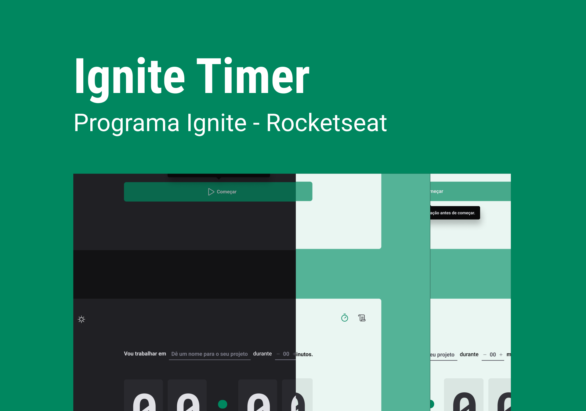
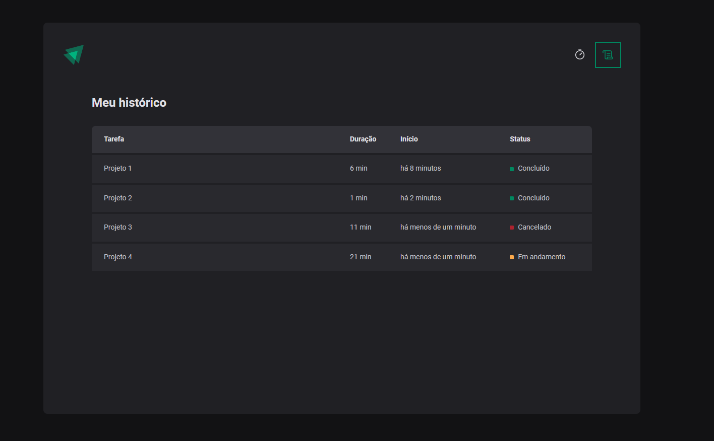

<h1 align="center">
  Ignite Timer
</h1>

<br></br>

<p align="center">
  <a href="#-Technologies"><b>Technologies</b></a>&nbsp;&nbsp;&nbsp;|&nbsp;&nbsp;&nbsp;
  <a href="#-Project"><b>Project</b></a>&nbsp;&nbsp;&nbsp;|&nbsp;&nbsp;&nbsp;
  <a href="#-Layout"><b>Layout</b></a>&nbsp;&nbsp;&nbsp;
</p>

<br>

<h1 align="center">
  
</h1>

<h1 align="center">
  
</h1>


## 🚀 Getting started

Clone the project and access the folder.

```bash
$ git clone https://github.com/diaspd/ignite-timer.git
$ cd 
```

## Installation

```bash
$ npm install
```

## Running the app

```bash
$ npm run dev
```

The app will be available on `http://localhost:5173/`

<br></br>

## 💻 Technologies

This project was developed with the following technologies:

- React
- Styled Components
- TypeScript
- Vitejs

## 📄 Project
💰 A timer with storic.

<br></br>

## 🔖 Layout
- [Ignite Timer - Figma](https://www.figma.com/community/file/1127351821076435124)


<br></br>

Made with ♥ by Pedro Dias. 👋 Follow me on social media! <br></br>

If you can give a little star, I appreciate it 🤩
